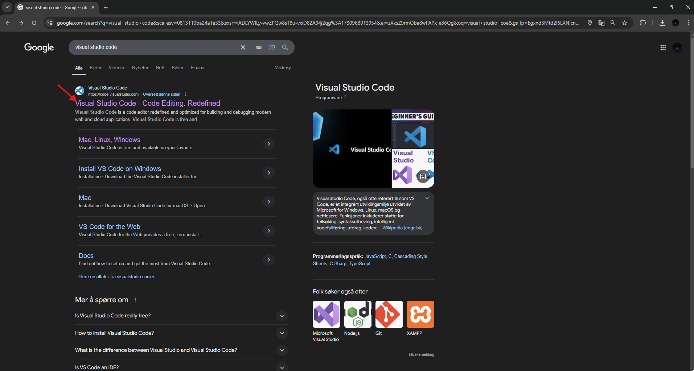
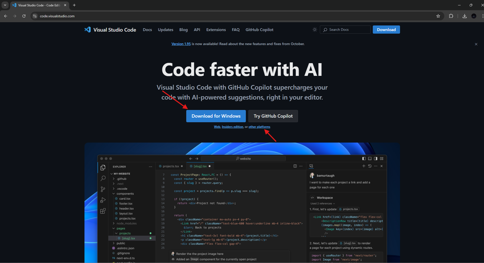
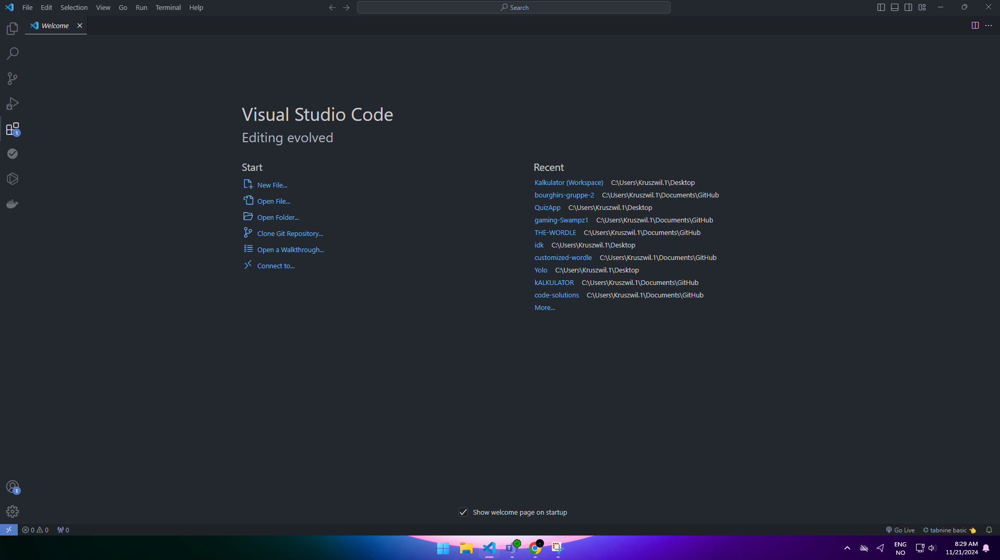
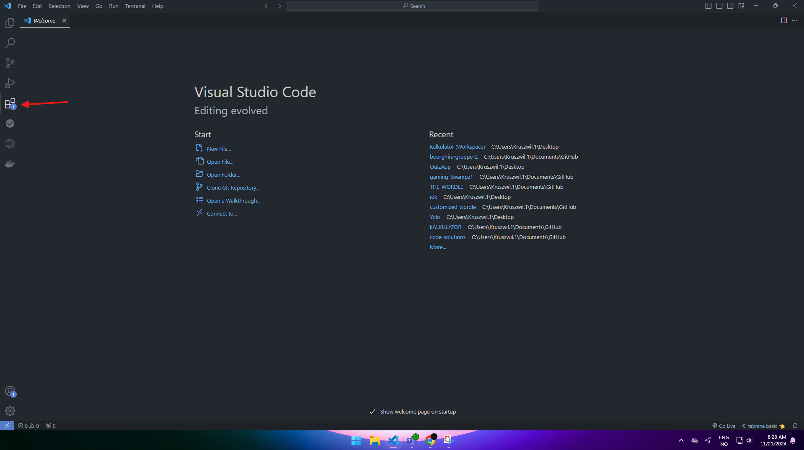
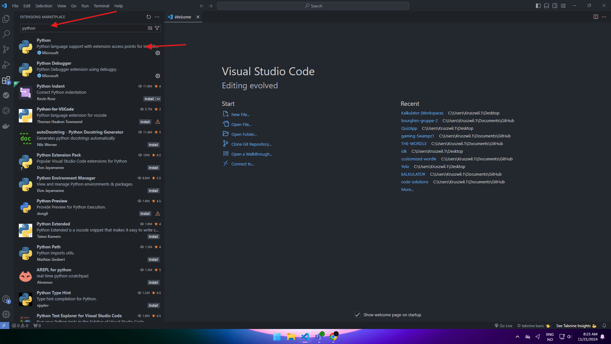
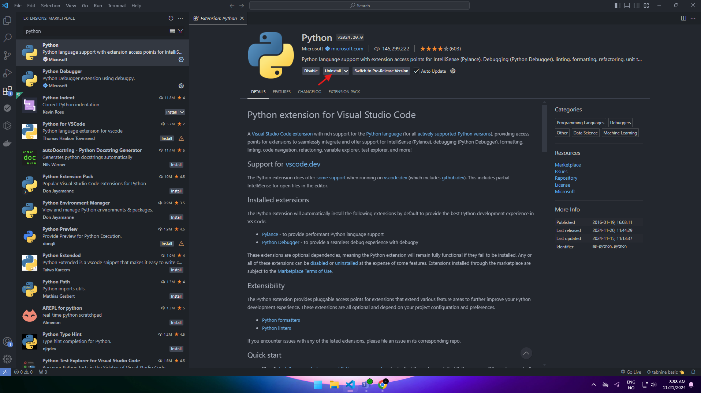
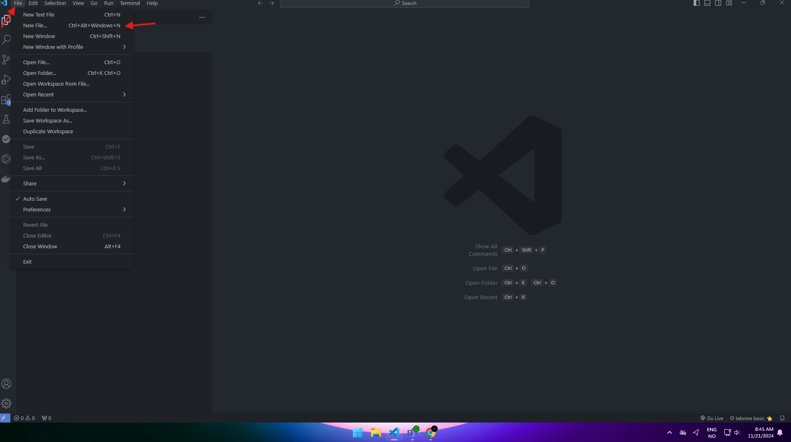
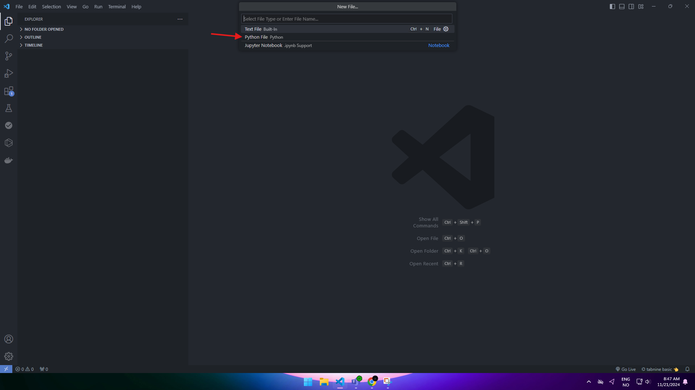
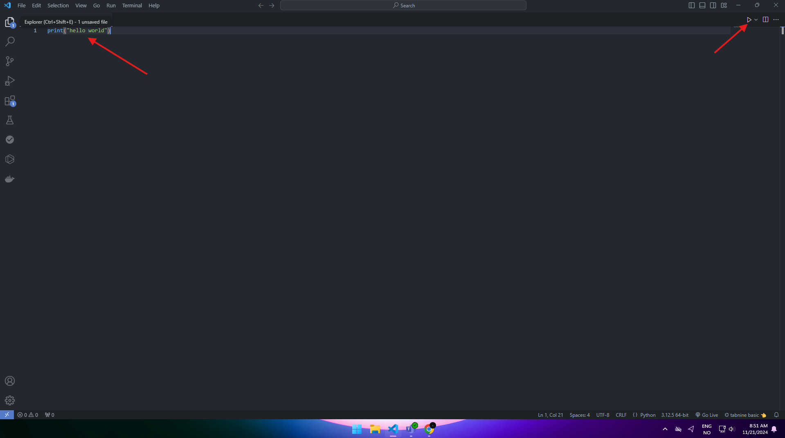
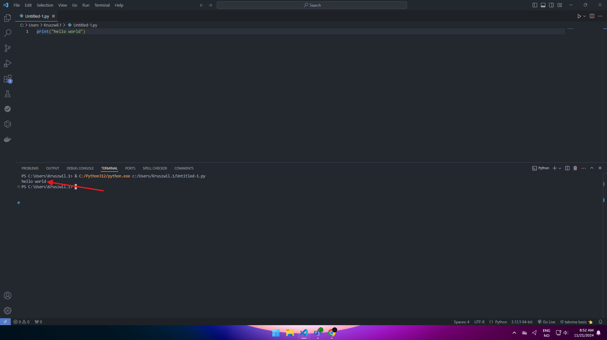

#Tutorial for Visual Studio Code
Hvordan laste ned og gjør klar program for koding. 

1.1 Gå først til din favoritt nettleser og skriv inn Visual Studio Code eller trykk på lenken (her). 

 

1.2 Når man er på siden trykker man på Download for windows vist man ikkje bruker windows kan me trykke på den små lenken under “Download for Windows” som sier “other platforms” der kan man velge for kva Operativt system man vil laste programmet for. 

  


1.3 Etter man har trykket på download for windows kommer me til ein slik side. 

 

 

Vist man ser i høyre hjørne oppe kan me se “ VSCodeUserSetup-x64-1.95.1.exe” 

1.4 trykk på “ VSCodeUserSetup-x64-1.95.1.exe” og gjennomfør installasjonen. 


2 . Åpne Visual Studio Code, når programmet er åpent bør man få eit slikt vindu opp. 

  


2.1 Før man stater kan vi gå først til Extensions og laste ned språket man vil kode med. 
 

2.2 Etter me har trykkt på Extensions kan me trykke på søke feltet og søke på kva programmerinspråk man vil kode med. I dette tilfelle har eg valgt Python. 

 
 

2.3 Trykk på install knappen. (for meg viser det uninstall fordi eg allerede har lastet ned) 
 


2.4  Etter du har installert kan du trykke på file. 
 


2.5 Etter du har trykkt på new file børde dette komme opp, da trykker me Python file 
 

3 . Nå som me har gjort alt klart kan du begynne å kode! Når du vil teste koden kan du trykke på den likke trikanten i hjørnet. 

  
``` py
Print("Hello world");
```

3.1 Vist man trykker på trekanten børde dette komme opp: 

  


3.2 Nå kan du kode  i vei! 